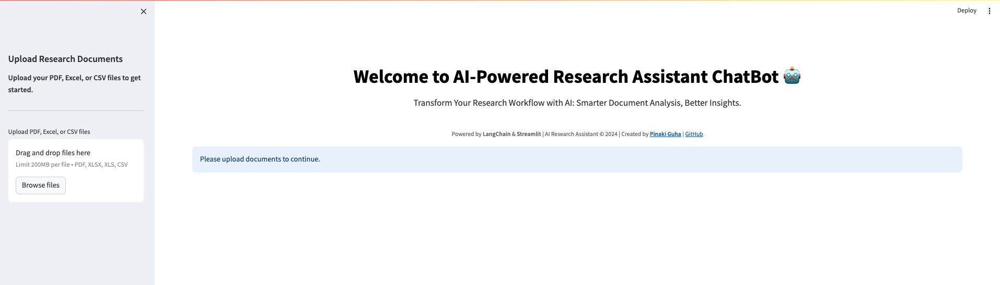
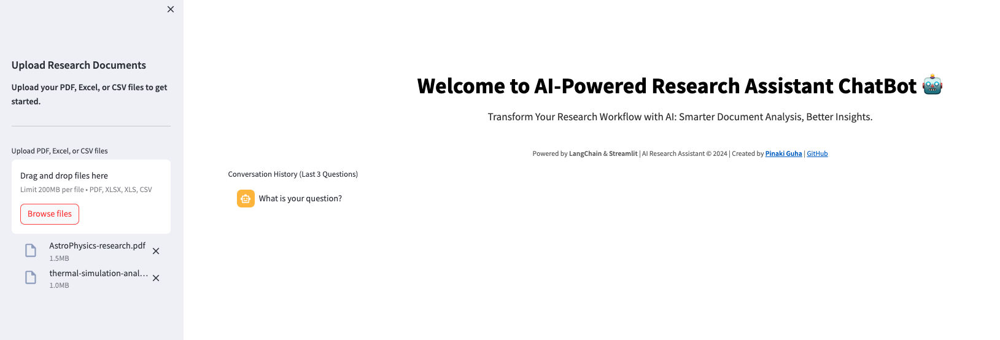
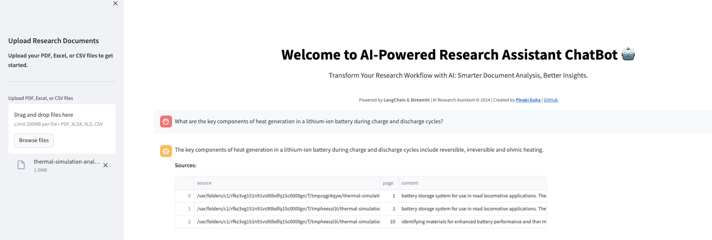
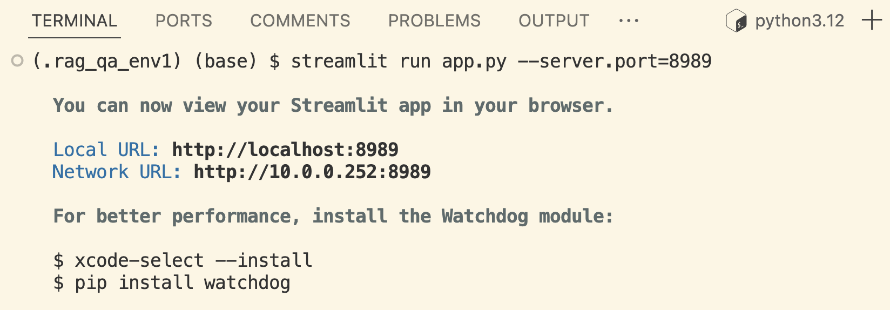

# 🧠 Research Assistant ChatBot

A powerful and intelligent research assistant built using **LangChain** and **Streamlit**, leveraging **Retrieval Augmented Generation (RAG)** to provide context-aware responses directly from your documents.

## 🌟 Features

- **User-Friendly Interface**: Built with Streamlit, offering a clean, intuitive UI.
  
  

- **Multi-Format Document Processing**: Supports PDF, Excel, and CSV files.

  
  
- **Contextual Intelligence**: Powered by GPT-4 and RAG architecture for precise, contextually-aware responses.

  

- **Real-time Response Streaming**: Instant AI responses as they are being generated.
- **Customizable Themes**: Switch between light and dark modes.


## 🚀 Getting Started

### Installation Instructions

#### 1. Clone the repository:

```bash
git clone https://github.com/yourusername/research-assistant-chatbot.git
cd research-assistant-chatbot
```

### 2. Set up  a virtual environment:
```bash
python -m venv venv
source venv/bin/activate  # On Windows: venv\Scripts\activate
```


### 3. Install dependencies:
```bash
pip install -r requirements.txt
```

### 4. Create an `api_credentials.yml` file in the root directory:
```yaml
openai_api_key: "your-api-key-here"
```

## 🚀 Usage

1. **Start the application:**
```bash
streamlit run app.py --server.port=8989
```



2. **Open the web app:** Open your web browser and navigate to `http://localhost:8501`

3. **Upload documents:** Upload your research documents (PDF, Excel, or CSV)

4. **Ask questions:** Interact with the AI by asking questions about your uploaded documents.

## 💡 Example Questions

- "What are the key findings in the uploaded research papers?"
- "Can you summarize the data from the Excel sheets?"
- "What are the main trends in the CSV data?"
- "Compare the methodologies used in different papers."

## 🔧 Configuration

The application can be configured through the following environment variables:
- `OPENAI_API_KEY`: Your OpenAI API key
- `STREAMLIT_THEME`: Light or Dark theme preference
- `CHUNK_SIZE`: Size of document chunks for processing (default: 1500)
- `CHUNK_OVERLAP`: Overlap between chunks (default: 200)

## 📝 License

This project is licensed under the MIT License.

## 🤝 Contributing

Feel free to fork the repository and submit a pull request to contribute to the project.

## 📧 Contact

Pinaki Guha  - [pinaki.guha@gmail.com](mailto:pinaki.guha@gmail.com)

Project Link: [https://github.com/gpinaki/research-assistant-rag/](https://github.com/gpinaki/research-assistant-rag)


